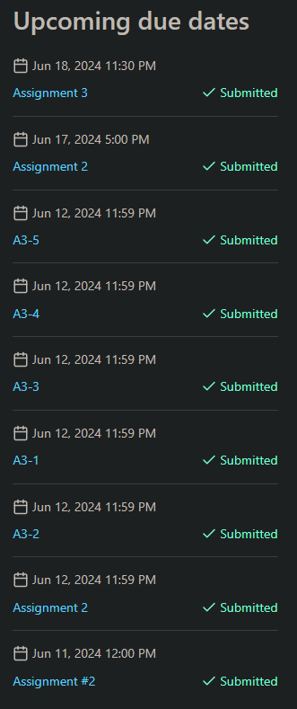
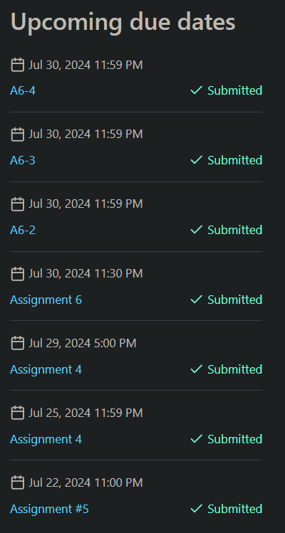

<!-- TODO
Style coop courses somehow
Style per-department
Get an actual website template
Blog? Resume? 
-->

tl;dr if your Crowdmark doesn't consistently look like this, what are you doing? 

 

After five years of undergrad I've finally graduated with a B.CS, minored in pure math, C&O, and chemistry, all with a 96% cumulative average.

<table class="center" border="1" width="70%">
  <caption>
  °Taken over co-op following the relevant term. *1–2% bonus. †Suspected/small curve. ‡Significant curve.
  </caption>
  <thead>
    <tr>
      <th>Term</th>
      <th>Course</th>
      <th>Grade</th>
    </tr>
  </thead>
  <tbody>
    <tr>
      <th rowspan="5">1A</th>
      <td>
        <a
          title="Designing Functional Programs"
          >CS135</a
        >
      </td>
      <td>97</td>
    </tr>
    <tr>
      <td>
        <a
          title="Introduction to Macroeconomics"
          >ECON102</a
        >
      </td>
      <td>99</td>
    </tr>
    <tr>
      <td>
        <a
          title="Introduction to Academic Writing"
          >ENGL109</a
        >
      </td>
      <td>89</td>
    </tr>
    <tr>
      <td>
        <a
          title="Algebra for Honours Mathematics"
          >MATH135</a
        >
      </td>
      <td>100*</td>
    </tr>
    <tr>
      <td>
        <a
          title="Calculus 1 for Honours Mathematics"
          >MATH137</a
        >
      </td>
      <td>98</td>
    </tr>
    <tr>
      <th rowspan="5">1B</th>
      <td>
        <a
          title="General Chemistry 1"
          >CHEM120</a
        >
      </td>
      <td>96</td>
    </tr>
    <tr>
      <td>
        <a
          title="Elementary Algorithm Design and Data Abstraction"
          >CS136</a
        >
      </td>
      <td>95</td>
    </tr>
    <tr>
      <td>
        <a
          title="Communications in Mathematics & Computer Science"
          >ENGL119</a
        >
      </td>
      <td>91</td>
    </tr>
    <tr>
      <td>
        <a
          title="Linear Algebra 1 for Honours Mathematics"
          >MATH136</a
        >
      </td>
      <td>100*</td>
    </tr>
    <tr>
      <td>
        <a
          title="Calculus 2 for Honours Mathematics"
          >MATH138</a
        >
      </td>
      <td>99</td>
    </tr>
    <tr>
      <th rowspan="6">2A</th>
      <td>
        <a
          title="Organic Chemistry 1"
          >CHEM264</a
        >
      </td>
      <td>97</td>
    </tr>
    <tr>
      <td>
        <a
          title="Logic and Computation"
          >CS245</a
        >
      </td>
      <td>97</td>
    </tr>
    <tr>
      <td>
        <a
          title="Object-Oriented Software Development"
          >CS246</a
        >
      </td>
      <td>92</td>
    </tr>
    <tr>
      <td>
        <a
          title="Computer Organization and Design"
          >CS251</a
        >
      </td>
      <td>100‡</td>
    </tr>
    <tr>
      <td>
        <a
          title="Probability"
          >STAT230</a
        >
      </td>
      <td>100‡</td>
    </tr>
    <tr>
      <td>
        <a
          title="Calculus 3 for Honours Mathematics"
          >MATH237°</a
        >
      </td>
      <td>100</td>
    </tr>
    <tr>
      <th rowspan="5">2B</th>
      <td>
        <a
          title="Structure and Bonding"
          >CHEM212</a
        >
      </td>
      <td>98†</td>
    </tr>
    <tr>
      <td>
        <a
          title="Organic Chemistry 2"
          >CHEM265</a
        >
      </td>
      <td>98</td>
    </tr>
    <tr>
      <td>
        <a
          title="Data Structures and Data Management"
          >CS240</a
        >
      </td>
      <td>94†</td>
    </tr>
    <tr>
      <td>
        <a
          title="Foundations of Sequential Programs"
          >CS241</a
        >
      </td>
      <td>91</td>
    </tr>
    <tr>
      <td>
        <a
          title="Introduction to Combinatorics"
          >MATH239</a
        >
      </td>
      <td>95</td>
    </tr>
    <tr>
      <th rowspan="7">3A</th>
      <td>
        <a
          title="Spectroscopy in Organic Chemistry"
          >CHEM464</a
        >
      </td>
      <td>95</td>
    </tr>
    <tr>
      <td>
        <a
          title="Introduction to Optimization"
          >CO250</a
        >
      </td>
      <td>97</td>
    </tr>
    <tr>
      <td>
        <a
          title="Algorithms"
          >CS341</a
        >
      </td>
      <td>96‡</td>
    </tr>
    <tr>
      <td>
        <a
          title="Operating Systems"
          >CS350</a
        >
      </td>
      <td>87‡</td>
    </tr>
    <tr>
      <td>
        <a
          title="Linear Algebra 2 for Honours Mathematics"
          >MATH235</a
        >
      </td>
      <td>99</td>
    </tr>
    <tr>
      <td>
        <a
          title="Introduction to Real Analysis"
          >PMATH333</a
        >
      </td>
      <td>100†</td>
    </tr>
    <tr>
      <td>
        <a
          title="Compiler Construction"
          >CS444°</a
        >
      </td>
      <td>100</td>
    </tr>
    <tr>
      <th rowspan="5">3B</th>
      <td>
        <a
          title="Introduction to Graph Theory"
          >CO342</a
        >
      </td>
      <td>96</td>
    </tr>
    <tr>
      <td>
        <a
          title="Numerical Computation"
          >CS370</a
        >
      </td>
      <td>96</td>
    </tr>
    <tr>
      <td>
        <a
          title="Groups and Rings"
          >PMATH347</a
        >
      </td>
      <td>98†</td>
    </tr>
    <tr>
      <td>
        <a
          title="Real Analysis"
          >PMATH351</a
        >
      </td>
      <td>97</td>
    </tr>
    <tr>
      <td>
        <a
          title="Statistics"
          >STAT231</a
        >
      </td>
      <td>91</td>
    </tr>
  </tbody>
</table>
